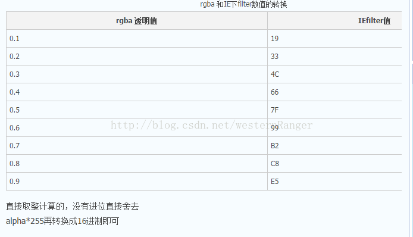

# JS

### 简单数据类型

number、string、boolean、undefined、null

### 复杂数据类型

Array数组  Function函数  Object对象   Math   RegExp正则表达式   Date

#### 显示转换

toString   num.toString()

String     num.String()

Number    str.Number()

parseInt    str.parseInt()

parseFloat     str.parseFloat()

Boolean     num/str.Boolean()

#### 隐式转换

num+""，有一边是字符串就是字符串拼接；

+，运算 ，运算符2边，转换成数字

!取反

转换成false  空字符串  0  false  null  undefined

#### 自增

```javascript
var a = 1; var b = ++a + ++a; console.log(b);   //5
                   2/2 + 2/2
var a = 1; var b = a++ + ++a; console.log(b);   //4
				   2(//把值给后面后自增)/1(//给之后的运算的值) + 3（//得到前面的值再先自增2+1（此时的a是前面自增后的a=2））/3						
var a = 1; var b = a++ + a++; console.log(b);   //3
var a = 1; var b = ++a + a++; console.log(b);  //4
```

逻辑运算符

```javascript
&&  两个操作数同时为true，结果为true，否则都是false
||  两个操作数有一个为true，结果为true，否则为false
!   取反
```

比较运算符

```javascript
<  >  >=  <= == != === !==
```

比较规则：

- 两边都为字符串时，则按照字符串的字符编码进行逐位比较
- 一边为数字，一边为字符串时，则将字符串转换为数字进行比较
- 一边为数字，一边为布尔值时，则将布尔值转换为数字进行比较

赋值运算符

=   +=   -=   *=   /=   %=

### continue和break

> break:立即跳出整个循环，即循环结束，开始执行循环后面的内容（直接跳到大括号）
>
> continue:立即跳出当前循环，继续下一次循环（跳到i++的地方）

```javascript
Watch:监视，通过watch可以监视变量的值的变化，非常的常用。
F10:程序单步执行，让程序一行一行的执行，这个时候，观察watch中变量的值的变化。
F8：跳到下一个断点处，如果后面没有断点了，则程序执行结束。
```

#### 嵌套循环

```javascript
for(var i =1 ; i <= 9 ;i++){
        for(var j = 1 ; j <= i ; j++){
            document.write(j+"*"+i+"="+(j*i < 10? "&nbsp;&nbsp;"+i*j : i*j)+"&nbsp;&nbsp;&nbsp;&nbsp;");  
        }
         document.write("<br>");
}
```

短路运算

```
如果参与逻辑运算的表达式，第一个式子就能决定整个逻辑表达式的结果，那么就不会去算第二个式子的值，这个就是短路运算。
var num1 = 10;
var num2 = 20;
var res = num1 < 0  &&  num2++ > 0;
console.log(res); //false
console.log(num2); //20

var res2 = num1 > 0 || ++num2 > 0;
console.log(res2); //true
console.log(num2); //20
```

2.1 逻辑与表达式

```
找假，如果第一个式子能够转换成布尔类型的false的话， 那么整个逻辑与表达式的结果就是第一个式子的值;如果第一个式子不能转换成布尔类型的false的话，那么整个逻辑与表达式的结果就是第二个式子的值，不管第二个式子是什么
```

2.2 逻辑或表达式

```
找真，如果参与逻辑或运算的第一个表达式能够转换成布尔类型的true的话，那么这整个逻辑或表达式的结果就是第一个式子的值；
```

#### 数组

常用方法：

```javascript
concat() 连接两个或更多的数组，并返回新数组。
join() 把数组的所有元素转换成一个个字符串。元素通过指定的分隔符进行分隔。返回的是字符串 
pop() 删除并返回数组的最后一个元素 
push() 向数组的末尾添加一个或更多元素，并返回新的长度。 
reverse() 颠倒数组中元素的顺序。
shift() 删除并返回数组的第一个元素 
slice() 从某个已有的数组返回选定的元素 
sort() 对数组的元素进行排序 ，参数：规定排序顺序。必须是函数
splice() 删除元素，并向数组添加新元素。 
toSource() 返回该对象的源代码。
toString() 把数组转换为字符串，并返回结果。
toLocaleString() 把数组转换为本地数组，并返回结果。 
unshift() 向数组的开头添加一个或更多元素，并返回新的长度。  
valueOf() 返回数组对象的原始值 
```


遍历数组

```javascript
for(var i = 0; i < arr.length; i++) {
	// 数组遍历的固定结构
}
```

新增元素

```javascript
arr[arr.length] = 'pink';
```

弹出输入框

prompt("请输入你的名字","张三");

页面显示(创建页面结构)

document.write()

```javascript
 var arr = ["script","arr","javascript","html","css","function"]
    document.write ("<ul>");
        for(var i=0;i<arr.length;i++) {
            document.write ("<li style=list-style:none;>")
                document.write (arr[i]);
            document.write ("</li>")
        }
    document.write ("</ul>");
```

去重

```javascript
var arr = [1,2,3,3,432,43,42,44,33,43,432,24,23];
    var newArr = [];
    var obj = {};
    for (var i = 0; i < arr.length; i++) {
        if (!obj[arr[i]]) {
            obj[arr[i]] = 1;
            newArr.push(arr[i]);
        }
        
    }
    console.log(newArr)
//冒泡
     for (var i = 0; i < newArr.length-1; i++) {
        var flag = true;
        for (var j = 0; j < newArr.length-1-i; j++) {
            if (newArr[j]>newArr[j+1]) {
                var temp = newArr[j];
                newArr[j] =newArr[j+1];
                newArr[j+1] = temp;
                flag = false;
            }
        }
       if (flag) {
           break;
       }
    }
    console.log(newArr);
```

### 函数

#### 回调函数

一个函数是另一个函数的参数，这个函数就是回调函数

```javascript
function f1(fn){
  	console.log(111);
    fn();
}
f1(test);
```

#### 自调用函数

```javascript
1.(function (){
      console.log("哈哈");
 })();
2.(function (){
     console.log("嘿嘿");
  }());
```

### arguments的使用

> JavaScript中，arguments对象是比较特别的一个对象，实际上是当前函数的一个内置属性。也就是说所有函数都内置了一个arguments对象，arguments对象中存储了传递的所有的实参。arguments是一个伪数组，因此也可以进行遍历

```javascript
	//a.只能在函数内部被访问.
    //b.arguments是一个伪数组(有下标索引，可以存放多个值，但是他里面没有数组的方法。)
    //c.arguments里面存的是什么？函数的实际参数传递过来的值。
    //d.arguments和函数的形参是对应的。有一个的值改了，对应的也要改。
```


预解析过程：

1. 把变量的声明提升到当前作用域的最前面，只会提升声明，不会提升赋值。
2. 把函数的声明提升到当前作用域的最前面，只会提升声明，不会提升调用。
3. 先提升var，在提升function

#### 如果变量名 和函数名  重名会怎么样？

```
//a.如果变量有值，那么输出的就是变量的值。
//b.如果变量没有值，那么输出的就是这个函数
```

this的指向（谁调用，指向谁）

```javascript
 var length = 10; 
    function fn() {
          console.log(this);
          console.log(this.length);
    
    }
    
    var obj = {
    
        length: 5,
    
        method: function (f) {
    
            f(); //window调用
            console.log(arguments[0]);
    
            arguments[0](); //arguments调用
            console.log(this)
            arguments[0].call(this); //this是obj对象
    
    }
    
    }
    
    obj.method(fn); 
```

### 兼容

```javascript
//获取元素文本
function getText(ele){
  if(ele.textContent == undefined){
    return ele.innerText; //IE8及之前的浏览器
  }else{
    return ele.textContent;
  }
}
//设置元素文本
function setText(ele,txt){
  if(ele.textContent == undefined){
    ele.innerText = txt;
  }else{
    ele.textContent = txt;
  }
}
//注册事件
function addEventListener(obj,type,listener){
  if(obj.addEventListener){
    obj.addEventListener(type,listener,false);//Chrome浏览器支持，false表示支持冒泡(默认)，true支持捕获
  }else if(obj.attachEvent){
    obj.attachEvent("on"+type,listener);//IE8之前支持
  }else{
    obj["on"+type] = listener;//更老的浏览器
  }
}
//获取下一个元素节点
function getNextElement(ele){
  if(ele.nextElementSibling){  
    return ele.nextElementSibling;
  }else{							//IE8及之前的浏览器
    var node = ele.nextSibling;
    while(node.nodeType != 1){
      node = node.nextSibling
    }
    return node;
  }
}
//获取上一个元素节点
function getPreviousElement(ele){
  if(ele.previousElementSibling){
    return ele.previousElementSibling;
  }else{
    var node = ele.previousSibling;
    while(node.nodeType != 1){
      node = node.previousSibling;
    }
    return node;
  }
}
 //要拿到元素的第一个子元素节点
  function getFirstElmentChild(ele){
    if(ele.firstElementChild){
      return ele.firstElementChild;
    }else {
      //到了这里，就说明当前这个浏览器是ie8及以前的。
      var node = ele.firstChild;
      while(node.nodeType != 1){
        node = node.nextSibling;
      }
      return node;
    }
  }
//获取元素的最后一个 子元素节点
  function getLastElementChild(ele){
    if(ele.lastElementChild){
      return ele.lastElementChild;
    }else {							//IE8及之前的浏览器
      var node = ele.lastChild;
      while(node.nodeType != 1){
        node = node.previousSibling;
      }
      return node;
    }
  }
//获取元素样式
function getStyle(obj,attr){

  if(obj.currentStyle){
    return obj.currentStyle[attr];
  }else {
    //如果到了这里，就表示此时的浏览器是谷歌和火狐。不支持currentStyle，但是支持getComputedStyle
    return window.getComputedStyle(obj,null)[attr];
  }
}
//获取页面的scrollTop的值封装函数
function getPageScroll(){
  return {
    scrollTop : window.pageYOffset || document.documentElement.scrollTop || document.body.scrollTop || 0,
    scrollLeft :  window.pageXOffset || document.documentElement.scrollLeft || document.body.scrollLeft || 0
  };
}
//获取页面的clientWidth和clientHeight，不同的浏览器获取的方式不一样，所以要做兼容处理。
function getPageClient(){
  return {
    clientWidth : window.innerWidth|| document.documentElement.clientWidth|| document.body.clientWidth|| 0,
    clientHeight : window.innerHeight|| document.documentElement.clientHeight|| document.body.clientHeight|| 0,
  }
}
//获取事件对象里面的pageX和pageY做兼容处理
function getEventPage(e){
  e = e || window.event;
  return {
    pageX: e.pageX || e.clientX + document.documentElement.scrollLeft,
    pageY: e.pageY || e.clientY + document.documentElement.scrollTop
  };
}
//阻止事件冒泡，不同的浏览器有不同的阻止方式，所以要做兼容处理。
function stopPropagation(e){
  e = e || window.event;

  if(e.stopPropagation){
    e.stopPropagation();
  }else {
    e.cancelBubble = true;
  }
}
//事件冒泡：如果一个元素的某个事件被触发了，那么他的所有的父级元素，同样的事件都会被触发
//事件捕获： 先触发最外层的拥有相同事件的父级元素的这个事件，然后一层层的往里触发，直到事件源为止
//阻止默认事件
function preventDefault(e){
    e = e || window.event;
    if (e.preventDefault) {
      return e.preventDefault();
    }else{
      return e.returnValue = false;   //IE8及之前
    }
  }

//IE8及之前不支持rgba()透明度函数，IE8及之前设置背景色透明度的时候要做兼容
//利用filter滤镜
background: rgba(255,255,255,.1);  
filter:progid:DXImageTransform.Microsoft.gradient(startColorstr=#19ffffff,endColorstr=#19ffffff);
//#号后面的19。是rgba透明度0.1的IEfilter值。从0.1到0.9每个数字对应一个IEfilter值
 .opacity{ opacity:0.5; 
 filter:progid:DXImageTransform.Microsoft.Alpha(opacity=50); /*IE6~IE8*/ 
}

//使IE5,IE6,IE7,IE8兼容到IE9模式

<!–[if lt IE 9]>
<script src=”http://ie7-js.googlecode.com/svn/version/2.1(beta4)/IE9.js”></script>
<![endif]–>
```



阻止a标签跳转

```javascript
obj.onclick =function(){
  return false;
}
```

#### 属性API

 对象名.getAttribute();

对象名.setAttribute(属性名，属性值);

对象名.removeAttribute();

#### 节点

1.childNodes 获取的是子节点们。
 谷歌、火狐、ie9+ 他们获取的是子节点们(标签节点、空文本、非空文本、注释);
 ie8及以前 他们获取的也是子节点们(标签节点、非空文本、注释);

2.children 拿到的是元素的子元素节点。

3.下一个节点 nextSibling

4.下一个元素节点  nextElmentSibling

第一个子节点 firstChild

第一个子元素节点 firstElementChild

最后一个子节点  lastChild
最后一个子元素节点  lastElementChild

获取元素的父节点  parentNode

追加元素：  父节点.appendChild(子节点);

插入子元素   父元素.insertBefore(要插的元素,被插的元素);(剪切后插入)

删除子元素  父元素.removeChild(要删的元素);

通过某一个li标签他自己找到自己的父亲，然后根据自己的父亲再删掉自己。

```javascript
li.parentNode.removeChild(li);
```

父元素.replaceChild(要替换的元素,被替换的元素);

### 封装

选择好友

```javascript
<!DOCTYPE html>
<html>
<head lang="en">
    <meta charset="UTF-8">
    <title></title>
    <style>
        select {
            width: 100px;
            height: 150px;
        }
    </style>
</head>
<body>
<select name="" id="left" multiple> //multiple可以多选
    <option value="">林志玲</option>
    <option value="">范冰冰</option>
    <option value="">陈奕迅</option>
    <option value="">周杰伦</option>
    <option value="">胡歌</option>
    <option value="">爱谁谁</option>
</select>
<input type="button" value=">>" id="btn1"/>
<input type="button" value="<<" id="btn2"/>
<input type="button" value=">" id="btn3"/>
<input type="button" value="<" id="btn4"/>
<select name="" id="right" multiple>
</select>


<script>
  	function id(id){
      return document.getElementById(id);
  	}
    //1.获取元素
    var left = id("left");
    var right = id("right");
    var allRight = id("btn1");
    var allLeft = id("btn2");
    var selRight = id("btn3");
    var selLeft = id("btn4");


    //2.全部到右边 ， 给allRight这个按钮注册一个单击事件
    allMove(allRight,left,right);

    //3.全部追加到左边。
    allMove(allLeft,right,left);


    //-----------封装全部移动-------------------------------
    function allMove(btn,one,two) {
        btn.onclick = function () {
            for(var i = 0 ; i < one.children.length; i++){
                two.appendChild(one.children[i]);
                i--;
            }
        }
    }

    //4.把左边选中的项  追加到右边。  selRight设置单击事件
    selectMove(selRight,left,right);

    //5.把右边选中的项，追加到左边。
    selectMove(selLeft,right,left);

    //---------选中移动封装-----------------------
    function selectMove(btn,one,two){
        btn.onclick = function () {
            for(var i = 0 ; i < one.children.length; i++){
                if(one.children[i].selected){
                    two.appendChild(one.children[i]);
                    i--;
                }
            }
        }
    }

</script>
</body>
</html>
```

模拟搜索框

```javascript
<!DOCTYPE html>
<html lang="en">
<head>
    <meta charset="UTF-8">
    <meta name="viewport" content="width=device-width, initial-scale=1.0">
    <meta http-equiv="X-UA-Compatible" content="ie=edge">
    <title>搜索框</title>
    <style>
        *{
            margin: 0;
            padding: 0;
        }
        div {
            margin: 0 auto;
            margin-top: 100px;
            width: 310px;
        }
      
        #txt{
            width: 246px;
            height: 30px;
            outline: none;
            border: 2px solid #ccc;
            padding-left: 5px;
            border-right: none;
        }
        #search {
            width: 50px;
            height: 34px;
            border: 2px solid #ccc;
            
        }
        ul {
            list-style: none;
            width: 254px;
           
        }
        ul li {
            border: 1px solid #ccc;
        }
    </style>
    <script src="https://cdn.bootcss.com/jquery/3.2.1/jquery.min.js"></script>
</head>
<body>
<div id="box">
    <input type="text" id="txt"><input type="button" value="search" id="search">
    <ul id="keywords"></ul>
    
</div>
<script>
    var keywords = ['1','11','111','2','22','222','3','33','333'];
    var txt = document.getElementById('txt');
    var ul = document.getElementById('keywords');
    var box= document.getElementById('box');

    function setText(ele,text){    
        if (typeof ele.textContent =='string') {
            ele.textContent = text;
        }else{
            ele.innerHTML = text;
        }
    }
   
    txt.onblur = function(){    //失去焦点，ul列表隐藏
       
        	ul.innerHTML = '';
     
    }
    txt.onkeyup = function(){
        var txtValue = this.value.trim();  //获取文本框内容，trim()去掉字符串2边空格
        // console.log(txtValue);
        // if (txtValue == '') {
        //     ul.innerHTML= '';
        //     return;
        // }
        ul.innerHTML = '';  //每次判断生成ul的li标签之前，把原来ul中的内容给清空掉
        for(var i=0;i<keywords.length;i++){   //遍历数组中的元素
            if (keywords[i].indexOf(txtValue) != -1) {    //判断输入的内容是否在数组中的元素存在，在就生产li标签
                var liNew = document.createElement('li');
                
                setText(liNew,keywords[i]);
                ul.appendChild(liNew);   //添加到ul列表
                var bgc;
                liNew.onmouseover = function(){
                    bgc = this.style.backgroundColor;
                    this.style.backgroundColor = 'red';

                }
                liNew.onmouseout = function(){
                    this.style.backgroundColor = bgc;
                }
                liNew.onmousedown = function(e){  //onmousedown事件一点击就触发，onclick点击完才触发，如果用onclick,那么                                                           onblur（失去焦点事件）会比点击事件快触发，则onclick事件无法进行.
                    
                    // alert(111);
                 
                    txt.value = this.innerHTML;
                    console.log(this);
                    ul.innerHTML = '';
                    
                }

            }
        }
    }

    txt.onfocus = function(){
    	this.onkeyup()
    }

    // txt.onblur = function(){             //给onblur事件设置延迟，但是页面效果不好
    //     setTimeout(function(){
    //     	ul.innerHTML = '';
    //     },200)
    // }
</script>
</body>
</html>
```

#### 计时器

1.计时器 setInterval(code,delay);   //很多次
  参数1 ： 事件到了要做的事情。
  参数2 ： 就是间隔的时间  毫秒单位的
  返回值： 就是这个计时器的id，是number类型的。

setTimeout(code,delay)  //只有一次

清空计时器
  clearInterval(计时器id);

```javascript
<div>
		
	</div>
	<script>
	var pic = document.getElementById("pic");
	// var arr = ['00','01','02','03','04','05','06','07','08','09']
	// photo();
	function photo(){
		var date = new Date();
		var hour = date.getHours();
		var sec = date.getSeconds();
		
		// pic.src = "../../time/meimei/"+(arr[hour] || hour)+"_"+(arr[sec] || sec)+".jpg";
		pic.src = "../../time/meimei/"+(hour<10? "0"+hour : hour)+"_"+(sec < 10? "0"+sec : sec)+".jpg";

	}
	setInterval(photo,1000);
	</script>
```

字符串方法：(返回的是全新的字符串，而不是修改原始字符串)

```javascript
indexOf() 方法可返回某个指定的字符串值在字符串中首次出现的位置
charAt() 方法可返回指定位置的字符
charCodeAt() 方法可返回指定位置的字符的 Unicode 编码
sub() 方法用于把字符串显示为下标
sup() 方法用于把字符串显示为上标
toLowerCase() 方法用于把字符串转换为小写
toUpperCase() 方法用于把字符串转换为大写
```

ES6首字母大写

```javascript
function titleCase5(str) {  
    return str.toLowerCase().replace(/( |^)[a-z]/g, (L) => L.toUpperCase());  
}  
console.log(titleCase5(a));
```

window.onload 页面上所有的内容加载完毕之后，才触发这事件

window.onbeforeunload 页面关闭之前的时候触发这事件

window.onunload 页面关闭的时候触发这事件

#### location对象 (包含有关当前 URL 的信息)

 url = 协议名称 + ip(域名) + 端口号 + 目标资源路径

```javascript
//属性
hash	返回一个URL的锚部分
host	返回一个URL的主机名和端口
hostname	返回URL的主机名
href	返回完整的URL
pathname	返回的URL路径名。
port	返回一个URL服务器使用的端口号
protocol	返回一个URL协议
search	返回一个URL的查询部分
//方法
assign()	载入一个新的文档
reload()	重新载入当前文档
replace()	用新的文档替换当前文档
```

#### history对象

```javascript
go()	加载 history 列表中的某个具体页面
```

#### Navigator 对象属性

| 属性                                       | 说明                          |
| ---------------------------------------- | --------------------------- |
| [appCodeName](http://www.runoob.com/jsref/prop-nav-appcodename.html) | 返回浏览器的代码名                   |
| [appName](http://www.runoob.com/jsref/prop-nav-appname.html) | 返回浏览器的名称                    |
| [appVersion](http://www.runoob.com/jsref/prop-nav-appversion.html) | 返回浏览器的平台和版本信息               |
| [cookieEnabled](http://www.runoob.com/jsref/prop-nav-cookieenabled.html) | 返回指明浏览器中是否启用 cookie 的布尔值    |
| [platform](http://www.runoob.com/jsref/prop-nav-platform.html) | 返回运行浏览器的操作系统平台              |
| [userAgent](http://www.runoob.com/jsref/prop-nav-useragent.html) | 返回由客户机发送服务器的user-agent 头部的值 |

#### 如果一个对象和一个基本数据类型参与运算，那么这个对象先会调用他的valueOf()方法得到值和基本数据类型参与运算，如果用valueOf没有得到值，就调用这个对象的toString()方法，得到的值再来和基本数据类型参与运算。

#### in关键字的使用

1.可以判断某个对象中有没有某个属性。

2.判断数组中有没有对应的下标。

### 原型链

对象有原型，原型本身又是一个对象，原型又有原型， 所以这样就构成了一个原型链。

属性或者方法的访问规则：
如果一个对象要访问某个属性或者方法，先去自己里面找，如果找不到就去自己的原型中找，如果还找不到，就沿着原型链向上找，直到找到null为止，如果还找不到就报错或者undefined。

hasOwnProperty  判断某个对象中是否拥有某个属性或者方法

isPrototypeOf  判断某个对象是否是 另外一个对象的原型

propertyIsEnumerable    判断对象中的某个属性是否可以被遍历出来、 并且判断这个属性是否属于自身。 如果两个都满足就是true

构造函数直接点出来的，就是静态成员

实例化对象 点出来的就是实例成员

instanceof    判断 构造函数的原型 在不在这个对象的原型链上

#### 递归

```javascript
//斐波那契
var i = 0;
  var obj = {};
  function feiBo(n){
    i++;
    var num = obj[n]; //先去看第n位有没有已经求过，放在这个对象中了。
    if(num == undefined){
      if(n == 1 || n == 2){
        obj[n] = 1;
      }else {
        obj[n] = feiBo(n-1) + feiBo(n-2);
      }
    }
    return obj[n];
  }
console.log(feiBo(12));
console.log(i);
```

### 正则表达式

```javascript
/*	
	^   非
   .	[^\n\r]	除了换行和回车之外的任意字符

   \d	[0-9]		数字字符
   \D	[^0-9]	    非数字字符

   \s	[\f\r\n\t\v]	不可见字符
   \S	[^\f\r\n\t\v]	可见字符

   \w	[a-zA-Z0-9_]	单词字符(所有的字母数字和_)
   \W	[^a-zA-Z0-9_]	非单词字符
   */
var reg = new RegExp(/../)
var reg = /../
//正则中的或 |          |两边只要有一个出现了至少一次，就判断就true.
//优先级  ()  heia  hema
console.log(/he(i|m)a/.test("heiahema"));//true
console.log(/he(i|m)a/.test("heima"));//false
//[] -首先要知道简单类只表示一个字符，中括号中的任意的出现一个，就表示true
console.log(/[abc]/.test("3243546756a")); //true
console.log(/[abc]/.test("3243546756")); //false
//组合类
console.log(/H[1-7][^6-9]/.test("H80")); //false
console.log(/H[1-7][^6-9]/.test("H80aaaaH20")); //true
//边界
//^ 会匹配行或者字符串的起始位置
//$ 会匹配行或字符串的结尾位置
//严格匹配
//^  $  在一起 严格匹配
//量词
//  "*"	重复零次或更多 x>=0          {0,}
//  "+"	重复一次或更多次 x>=1        {1,}
//  "?"	重复零次或一次  x=(0||1)     {0,1}
//{n}	n次	x=n
// {n,}	重复n次或更多  x>=n
// {n,m} 重复出现的次数比n多但比m少 n<=x<=m
console.log(/colo*r/.test("colr")); //true
console.log(/colo*r/.test("coloooooor")); //true
console.log(/colo+r/.test("colr")); //false
console.log(/colo+r/.test("coloooooor")); //true
console.log(/colo?r/.test("color")); //true
console.log(/colo?r/.test("coloooooor")); //false
console.log(/(color){2,3}/.test("colorcolorcolorcolor")); //true  不是严格匹配，color出现2次或者3次就是对的。
console.log(/^(color){2,3}$/.test("colorcolorcolorcolor")); //false
//验证汉字
console.log(/[\u4e00-\u9fa5]/.test("123哈456嘿78"));  //true
console.log(/^[\u4e00-\u9fa5]{2,3}$/.test("小周洁姐"));  //false
//去掉一个字符串前后空格
function myTrim(str){
    var strNew = str.replace(/^\s+|\s+$/g,"");   //g 全局
    return strNew;
  }
var str2 = myTrim(str);
console.log("===="+str2+"===");
```

一个函数clone，可以克隆JS的5种数据类型

```javascript
function clone( obj ) {
    var copy;
    switch( typeof obj ) {
        case "undefined":
            break;
        case "number":
            copy = obj - 0;
            break;
        case "string":
            copy = obj + "";
            break;
        case "boolean":
            copy = obj;
            break;
        case "object":  //object分为两种情况 对象（Object）和数组（Array）
            if(obj === null) {
                copy = null;
            } else {
                if( object.prototype.toString.call(obj).slice(8, -1) === "Array") {
                    copy = [];
                    for( var i = 0 ; i < obj.length ; i++ ) {
                        copy.push(clone(obj[i]));
                    }
                } else {
                    copy = {};
                    for( var j in obj) {
                        copy[j] = clone(obj[j]);
                    }
                }
            }
            break;
        default:
            copy = obj;
            break;
    }
    return copy;
}
```

